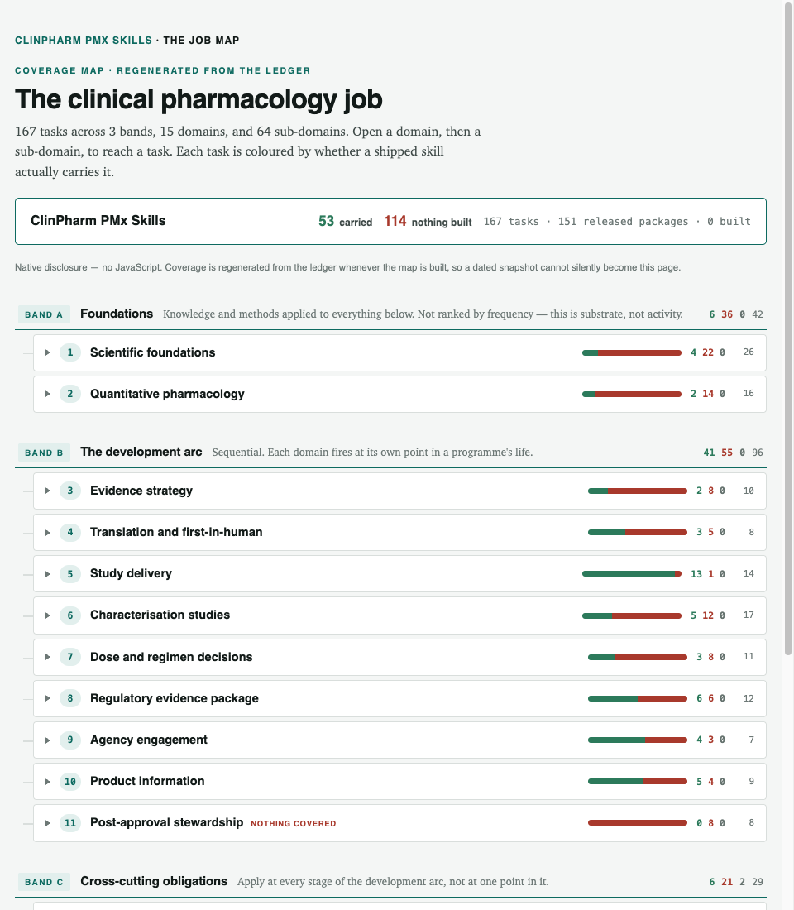
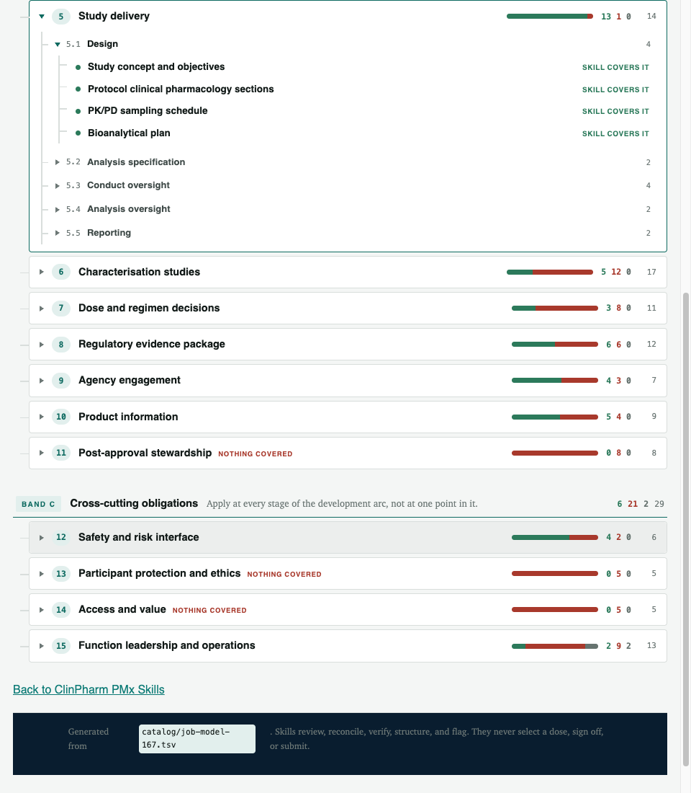

# ClinPharm PMx Skills

Portable Agent Skills for **clinical pharmacologists and pharmacometricians**
who review documents and analyses.

> **Turn any AI agent into a clinical pharmacologist and pharmacometrician.**
>
> *It reviews, reconciles, and prepares evidence. It never selects a dose, signs
> off, or submits.*

[](LICENSE)
[](https://github.com/malekokour/clinpharm-pmx-skills/releases)
[](CLAIM-LEDGER.md)
[](map/)
[](https://github.com/malekokour/clinpharm-pmx-skills/actions/workflows/quality.yml)
[](catalog/adapter-evidence.json)
[](https://www.linkedin.com/in/malek-okour-73020520/)

> [!IMPORTANT]
> **Skills review, reconcile, verify, structure, and flag. Qualified humans
> decide, approve, sign, and submit.** No skill selects a dose, resolves a
> scientific disagreement, edits a controlled document, or replaces clinical,
> pharmacometric, medical, regulatory, or quality judgment.

## Getting started

Host-by-host steps: [`docs/HOSTS.md`](docs/HOSTS.md).

### Paste a block (any web chat — no clone)

1. Open [`skills/verify-nca-outputs/PASTE.md`](skills/verify-nca-outputs/PASTE.md).
2. Paste it into Claude, ChatGPT, or any ordinary chat.
3. Attach the four files under [`examples/verify-nca-outputs/inputs/`](examples/verify-nca-outputs/inputs/).
4. Ask:

> Verify the NCA report against the parameter dataset and the analysis plan.
> Report every finding with its locator. Do not re-derive anything.

Every skill has the same web route: `skills/<id>/PASTE.md`. Review every finding
before using the output.

| | |
|---|---|
| Skill | [`verify-nca-outputs`](skills/verify-nca-outputs/) |
| What it catches | Reported `AUC` 8% off the dataset; a 1000-fold `CL/F` unit swap; an exclusion the plan does not allow |
| What it refuses | Deciding which of two conflicting values is scientifically correct; selecting a dose; rerunning the NCA |

More worked examples: [`examples/`](examples/).

### Install the library (desktop agents)

```bash
git clone https://github.com/malekokour/clinpharm-pmx-skills.git
cd clinpharm-pmx-skills
```

| Host | Then | Executed here? |
|---|---|---|
| **Claude Code** | `/plugin marketplace add malekokour/clinpharm-pmx-skills` then `/plugin install clinpharm-pmx-skills@clinpharm-pmx-skills` | ✅ full lifecycle, 2026-08-13 |
| **Cursor** | File → Open Folder on the clone | ✅ clone route, 2026-08-13 |
| **Codex / Antigravity** | Open the clone as the workspace | ⬜ documented, not run here |

Ask in a **new** chat:

> Which ClinPharm PMx Skills skill applies to reviewing PK sections of a CSR?

A loaded library names `review-csr-pk-consistency`. If the host answers without
naming a package, the skills did not load.

Prefer [`library-router`](skills/library-router/) when the right skill is
unclear. Keep each `skills/<id>/` directory intact. Clone the **whole
repository** — a single-folder copy is a degraded route (no router, no
`shared/`).

What ✅ and ⬜ mean, and the machine-readable attestation:
[`catalog/adapter-evidence.json`](catalog/adapter-evidence.json). **Loaded is not
exercised** — Claude Code listed all **151** packages after install; one skill
was then run end to end. See [`docs/COMPATIBILITY.md`](docs/COMPATIBILITY.md).

## What's in the library

| State | Packages | What it means |
|---|---:|---|
| `released` | **151** | Passed the structural gates and its assigned qualification route. |
| `built` | **0** | The package exists and validates, but qualification has **not** passed; its catalog row names the missing evidence. |
| **Total** | **151** | 133 clinical-pharmacology + 16 pharmacometrics + 2 utilities. |

**Name the gate.** `released` does **not** mean clinical validation, and it does
**not** mean the evaluation suite has qualified a package's *behaviour* — three
`blocker`-severity findings against that suite are open and frozen.
[`CLAIM-LEDGER.md`](CLAIM-LEDGER.md) and [`AGENTS.md`](AGENTS.md) say this in the
same words, and a gate fails the build if any of the three drifts.

The [catalog](docs/CATALOG.md) spans CSR and protocol review, CTD 2.7.2 and USPI
Section 12, DDI and FIH evidence, NCA verification, and cross-document
reconciliation. Each package follows the
[Agent Skills specification](https://agentskills.io/specification): `SKILL.md`
is the activation contract; `scripts/`, `references/`, and `assets/` load only
when needed.

## The job map

Writing the profession out as tasks was uncomfortable. You see how much of the
job nobody has built anything for.

|  |  |
|---|---:|
| Tasks in the job model | **167** |
| Carried by a skill today | **53** |
| **Not yet carried** | **114** |
| Domains | 15 |

That third row is the point. Live tree (open a domain, then a sub-domain):
[malekokour.github.io/clinpharm-pmx-skills/map/](https://malekokour.github.io/clinpharm-pmx-skills/map/).
On GitHub: [`map/`](map/) · [A](map/bands/A.md) · [B](map/bands/B.md) ·
[C](map/bands/C.md). Source: [`catalog/job-model-167.tsv`](catalog/job-model-167.tsv).





One subdomain, zoomed — a job, then a task, then a skill you can run:


## How it was built

Map the job. Decide what actually needs a skill. Build those. Write what each
one refuses. Publish the gaps with the wins.


The same recording plays on the
[site](https://malekokour.github.io/clinpharm-pmx-skills/#story) with controls.

## Evidence

Three claims that are often blurred stay separate here:

1. **Package validity** — structure, frontmatter, links, vendored dependencies,
   and clean installation are checked.
2. **Diagnostic evidence** — synthetic fixtures, planted defects, false-positive
   traps, and deterministic canaries show what the current test harness examines.
3. **Qualification** — risk-tiered behavioral comparison, accepted expert keys,
   held-out inputs, activation testing, practitioner review, and independent
   closeout are required before a package becomes `released`.

As of 2026-08-13, the public quality surface contains **151 evaluation suites,
1,197 cases, 4,510 assertions, 147 declared inputs, 67 portable scripts, and 225
repository tests**. Those are engineering denominators—not a clinical-performance
claim. Every one of them is re-derived from its source of record in
[`CLAIM-LEDGER.md`](CLAIM-LEDGER.md), and the build fails if this
sentence and the sources disagree. A historical CSR deterministic-path result is retained under
[`evals/benchmark/`](evals/benchmark/) as bounded diagnostic evidence after its broader
qualification claim was retracted.

Regenerate counts from [`CLAIM-LEDGER.md`](CLAIM-LEDGER.md) before quoting them.

## Safety and data boundary

Use only public, synthetic, or explicitly permitted information. Never upload
patient-level data, credentials, sponsor-confidential material, unpublished
submissions, employer-proprietary content, or personal contact details to an
unapproved service.

Fixtures in this repository are synthetic by construction, not anonymized from
real studies. This library is not medical advice, clinical decision support, a
validated GxP system, or a patient-specific decision tool.

## Contribute

Requires Python 3.11 or later **and the pinned dependencies**:

```bash
python3 -m venv .venv && source .venv/bin/activate
python3 -m pip install --requirement requirements.lock
```

**The `requirements.lock` install is required, not optional.** Without it,
`check_all.py` stops at `ModuleNotFoundError: No module named 'strictyaml'` and
exits 1. Then:

```bash
make check          # lint, validate, test, privacy, portability, and consistency
make docs-check     # prove generated documentation matches its authorities
make release-check  # build release assets in isolation and verify them
```

`python3 scripts/check_all.py` is the same gate as `make check`. It validates
the repository; it does not send documents anywhere.

Before contributing, read [CONTRIBUTING.md](CONTRIBUTING.md) and the public
[contributor contract](AGENTS.md). New workflows need a bounded job, an explicit
human-review boundary, synthetic failure cases, objective checks, and a truthful
evidence gap.

```text
map/             167 job-model task pages. Source: catalog/job-model-167.tsv
skills/          151 independently installable Agent Skill packages
contexts/        modality and therapeutic-area context files
collections/     editable status authority
catalog/         derived registry (do not edit by hand)
evals/           synthetic suites; historical records under evals/benchmark/
shared/          tools, modules, assets, contracts
examples/        worked synthetic examples
docs/ site/      documentation and GitHub Pages source
.claude-plugin/  Claude Code marketplace manifest
plugin.json      Agent Plugins 1.0.0 manifest
```

Collections own package status. `catalog/catalog.json` and `docs/CATALOG.md` are
generated views; the quality gate fails if they drift.

## Docs

**Use** — [Hosts](docs/HOSTS.md) · [Lifecycle](docs/LIFECYCLE.md) ·
[Compatibility](docs/COMPATIBILITY.md) · [Boundaries](docs/BOUNDARIES.md) ·
[Privacy](docs/PRIVACY.md)

**Evidence** — [Claim ledger](CLAIM-LEDGER.md) · [Catalog](docs/CATALOG.md) ·
[Job tree](docs/JOB-TREE.md) · [Roadmap](ROADMAP.md)

**Build** — [Authoring](docs/AUTHORING-A-SKILL.md) ·
[Architecture](docs/ARCHITECTURE.md) · [Governance](.github/GOVERNANCE.md) ·
[Glossary](docs/GLOSSARY.md) · [References](REFERENCES.md)

**Meta** — [Agent Skills](https://agentskills.io/specification) ·
[Agent Plugins](https://agent-plugins.org/) · [Security](SECURITY.md) ·
[Citation](CITATION.cff)

## License

MIT — see [LICENSE](LICENSE).
