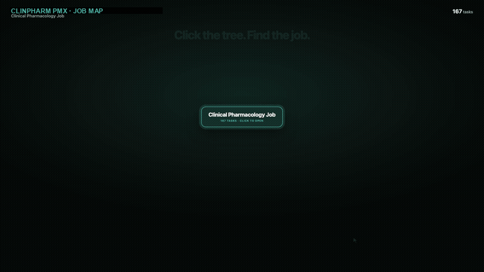

# ClinPharm PMx Skills

Portable Agent Skills for **clinical pharmacologists and pharmacometricians**
who review documents and analyses.

> **Turn any AI agent into a clinical pharmacologist and pharmacometrician.**
>
> *It reviews, reconciles, and prepares evidence. It never selects a dose, signs
> off, or submits.*

[](https://github.com/malekokour/clinpharm-pmx-skills/actions/workflows/quality.yml)
[](https://agentskills.io/specification)
[](LICENSE)
[](ROADMAP.md)

> [!IMPORTANT]
> **Skills review, reconcile, verify, structure, and flag. Qualified humans
> decide, approve, sign, and submit.** No skill selects a dose, resolves a
> scientific disagreement, edits a controlled document, or replaces clinical,
> pharmacometric, medical, regulatory, or quality judgment.

## Try one example

Synthetic NCA report vs its dataset — planted defects, no real study.

Ask:

> Verify the NCA report against the parameter dataset and the analysis plan.
> Report every finding with its locator. Do not re-derive anything.

| | |
|---|---|
| Skill | [`verify-nca-outputs`](skills/verify-nca-outputs/) |
| Inputs | [`examples/verify-nca-outputs/inputs/`](examples/verify-nca-outputs/inputs/) |
| What it catches | Reported `AUC` 8% off the dataset; a 1000-fold `CL/F` unit swap; an exclusion the plan does not allow |
| What it refuses | Deciding which of two conflicting values is scientifically correct; selecting a dose; rerunning the NCA |

Zero install: paste [`skills/verify-nca-outputs/PASTE.md`](skills/verify-nca-outputs/PASTE.md) into any chat, attach the four input files, ask the same question.

Two more shapes — regulatory label and project context — are in [`examples/`](examples/).

## The map — 167 tasks, and the 114 we do not cover yet

**[`map/`](map/) — the profession, mapped.** One page per task, citable by a
stable path, rendering directly on GitHub.

|  |  |
|---|---:|
| Tasks in the job model | **167** |
| Carried by a skill today | **53** |
| **Not yet carried** | **114** |
| Domains | 15 |

That third row is the point. Every comparable library ships skills and
evaluations; none publishes the shape of the job those skills are for, so none
can tell you what fraction of your work it touches. This one can, and the answer
today is *less than a third*.



Browse by band: [A](map/bands/A.md) · [B](map/bands/B.md) · [C](map/bands/C.md).
Machine-readable: [`map/job-model.json`](map/job-model.json). HTML rendering:
[`site/map/`](site/map/). Both are generated from
[`catalog/job-model-167.tsv`](catalog/job-model-167.tsv). GitHub Pages is not
enabled; the map is this repository.

## Current evidence status

| State | Packages | What it means |
|---|---:|---|
| `released` | **151** | The package passed its assigned evidence gate. |
| `built` | **0** | The package exists and validates, but qualification has **not** passed; its catalog row names the missing evidence. |
| **Total** | **151** | 133 clinical-pharmacology + 16 pharmacometrics + 2 utilities. |

The job model maps **167** tasks. **151** packages exist on disk (library target met).
Regenerate counts from [`CLAIM-LEDGER.md`](CLAIM-LEDGER.md) before quoting them.

## Install

### Paste a block (no clone)

Open any `skills/<id>/PASTE.md` and paste it into an ordinary chat window with
only the source material permitted in that environment. Review every finding
before using the output.

### Clone the library

```bash
git clone https://github.com/malekokour/clinpharm-pmx-skills.git
cd clinpharm-pmx-skills
python3 scripts/check_all.py
```

That command validates the repository; it does not send documents anywhere.

1. Clone this **whole repository** (primary install).
2. Point your host at the repo (or copy a complete `skills/<skill-id>/`
   directory if your host only supports single-skill install — degraded route).
3. Prefer [`library-router`](skills/library-router/) when the right skill is
   unclear; force a skill id when you already know it.
4. Keep each skill directory intact: `SKILL.md`, scripts, references, and assets
   form one package. Shared modules live under `shared/` for whole-repo use.
5. Ask for the workflow in natural language and inspect the resulting human
   review before acting.

Host installation locations differ. Follow the host's current documentation;
do not copy all packages globally unless you actually need them. This repository
does not ship host adapters or `plugin.json`.

## What is included

The [catalog](docs/CATALOG.md) spans:

- study documents: CSR, protocol, study-conduct, bioanalytical, and NCA review;
- regulatory content: CTD 2.7.2, USPI Section 12, briefing packages, agency
  questions, investigator's brochures, IND/IMPD content, DSURs, and annual reports;
- quantitative evidence: DDI, FIH rationale, dose-justification evidence, model
  deliverables, and development-plan gaps;
- cross-document governance: fact reconciliation, reference-safety information,
  benefit-risk table structure, and reusable work context.

Each package follows the open [Agent Skills specification](https://agentskills.io/specification):
`SKILL.md` carries the activation contract, while optional `scripts/`,
`references/`, and `assets/` are loaded only when needed.

## How evidence works

Three claims that are often blurred stay separate here:

1. **Package validity** — structure, frontmatter, links, vendored dependencies,
   and clean installation are checked.
2. **Diagnostic evidence** — synthetic fixtures, planted defects, false-positive
   traps, and deterministic canaries show what the current test harness examines.
3. **Qualification** — risk-tiered behavioral comparison, accepted expert keys,
   held-out inputs, activation testing, practitioner review, and independent
   closeout are required before a package becomes `released`.

As of 2026-08-12, the public quality surface contains **151 evaluation suites,
1,197 cases, 4,510 assertions, 147 declared inputs, 67 portable scripts, and 211
repository tests**. Those are engineering denominators—not a clinical-performance
claim. Every one of them is re-derived from its source of record in
[`CLAIM-LEDGER.md`](CLAIM-LEDGER.md), and the build fails if this
sentence and the sources disagree. A historical CSR deterministic-path result is retained under
[`evals/benchmark/`](evals/benchmark/) as bounded diagnostic evidence after its broader
qualification claim was retracted.

## Safety and data boundary

Use only public, synthetic, or explicitly permitted information. Never upload
patient-level data, credentials, sponsor-confidential material, unpublished
submissions, employer-proprietary content, or personal contact details to an
unapproved service.

Fixtures in this repository are synthetic by construction, not anonymized from
real studies. This library is not medical advice, clinical decision support, a
validated GxP system, or a patient-specific decision tool.

## Repository map

```text
map/           167 job-model task pages (Layer 1). Source: catalog/job-model-167.tsv
skills/        151 independently installable Agent Skill packages
contexts/      modality and therapeutic-area context files, attached after selection
collections/   editable status authority and domain navigation
catalog/       derived cross-package registry
evals/         synthetic suites; historical records under evals/benchmark/
shared/        canonical tools, modules, assets, and contracts vendored as needed
scripts/       validators, generators, privacy checks, and settings.example.json
docs/ site/    documentation and the checked-in static rendering (Pages is not enabled)
examples/      worked synthetic examples
tests/         repository and workflow regression tests
```

Collections own package status. `catalog/catalog.json` and `docs/CATALOG.md` are
generated views; the quality gate fails if they drift.

## Develop and verify

Requires Python 3.11 or later. The main commands are defined in the
[`Makefile`](Makefile):

```bash
make check          # lint, validate, test, privacy, portability, and consistency
make docs-check     # prove generated documentation matches its authorities
make release-check  # build release assets in isolation and verify them
```

Before contributing, read [CONTRIBUTING.md](CONTRIBUTING.md) and the public
[contributor contract](AGENTS.md). New workflows need a bounded job, an explicit
human-review boundary, synthetic failure cases, objective checks, and a truthful
evidence gap. Breadth without evidence is not a release criterion.

## Docs

[Claim ledger](CLAIM-LEDGER.md) · [Roadmap](ROADMAP.md) ·
[Catalog](docs/CATALOG.md) · [Boundaries](docs/BOUNDARIES.md) ·
[Authoring](docs/AUTHORING-A-SKILL.md) · [Architecture](docs/ARCHITECTURE.md) ·
[Compatibility](docs/COMPATIBILITY.md) · [Governance](.github/GOVERNANCE.md) ·
[Privacy](docs/PRIVACY.md) · [Glossary](docs/GLOSSARY.md) ·
[Job tree](docs/JOB-TREE.md) · [References](REFERENCES.md) ·
[Security](SECURITY.md) · [Citation](CITATION.cff)

## License

MIT — see [LICENSE](LICENSE).
